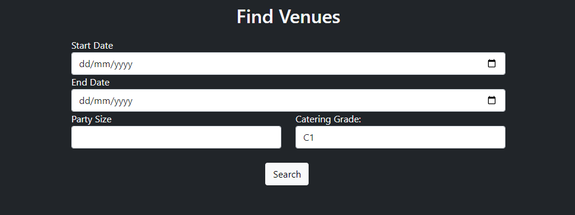
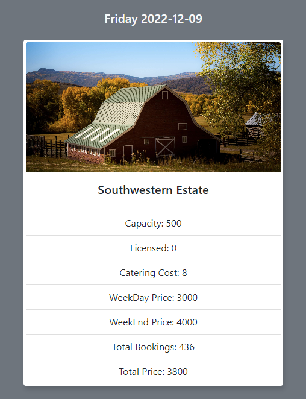

<!-- Improved compatibility of back to top link: See: https://github.com/othneildrew/Best-README-Template/pull/73 -->

<!--
*** Thanks for checking out the Best-README-Template. If you have a suggestion
*** that would make this better, please fork the repo and create a pull request
*** or simply open an issue with the tag "enhancement".
*** Don't forget to give the project a star!
*** Thanks again! Now go create something AMAZING! :D
-->

<!-- PROJECT SHIELDS -->
<!--
*** I'm using markdown "reference style" links for readability.
*** Reference links are enclosed in brackets [ ] instead of parentheses ( ).
*** See the bottom of this document for the declaration of the reference variables
*** for contributors-url, forks-url, etc. This is an optional, concise syntax you may use.
*** https://www.markdownguide.org/basic-syntax/#reference-style-links
-->

[![Contributors][contributors-shield]][contributors-url]
[![Forks][forks-shield]][forks-url]
[![Stargazers][stars-shield]][stars-url]
[![Issues][issues-shield]][issues-url]
[![MIT License][license-shield]][license-url]
[![LinkedIn][linkedin-shield]][linkedin-url]

<!-- PROJECT LOGO -->
<h1 align="center">Wedding Venue Finder</h1>

  

    Full-stack wedding venue finder application that allows to search for avaliable venues within a given range of dates.
  

<!-- TABLE OF CONTENTS -->

  
Table of Contents

  <ol>
    <li>
      <a href="#about-the-project">About The Project</a>
      <ul>
        <li><a href="#built-with">Built With</a></li>
      </ul>
    </li>
    <li><a href="#usage">Usage</a></li>
    <li><a href="#license">License</a></li>
    <li><a href="#contact">Contact</a></li>
  </ol>

<!-- ABOUT THE PROJECT -->

## About The Project

[![Product Name Screen Shot][product-screenshot]](https://wedding-finder.neilvaria.com)
Coursework that acheived an 88% score.

Hosted on Vercel. Had to configure Vercel and project to run PHP on back-end as PHP not natively supported by Vercel. Compressed all the images, so that the free file size limit of Vercel is not exceeded and to allow page to load quicker. Using subdomain of neilvaria.com, where my portfolio is hosted.

Written in PHP and javascript. Using bootstrap for front-end. Ajax is used to dynamically update content when querying the database for results.

MySQL database is hosted on a personal server at home, managed with mySQL workbench. Wrote a python program to generate more dates avaliable for booking from 2022-2025 as database originally used only contained data up until 2022.

(<a href="#readme-top">back to top</a>)

### Built With

- [![Bootstrap][bootstrap.com]][bootstrap-url]
- [![JQuery][jquery.com]][jquery-url]

(<a href="#readme-top">back to top</a>)

<!-- USAGE EXAMPLES -->

## Usage

### Using the search form to generate results.

  

 

The search form has form validation for the following:
- Start Date
  - *Input must be filled*
  - *Date must be current date or after current date*
  - *Cannot be later than end date*
- End Date
  - *Date must be within 7 days of start date*
  - *Date cannot be earlier than start date*
- Party Size
  - *Input must be filled*
  - *Party size must be a positive integer*
  - *Party size must be less than or equal to 1000*
- Catering Grade
  - *Input must be filled*

### When all validations are satisfied results are generated in the following format:

 
If there are no results for that day the following is displayed:
 
&nbsp;

  

 

Otherwise results are shown in cards:

  

 

- Date
  - *The date that venue is avaliable on in format (day year-mm--dd)*
- Image of Venue
- Capacity
  - *Maximum amount of people that venue allows*
- Licensed
  - *Displays 0 if venue is not licenced and 1 if it is (should have been changed to yes or no to be more user friendly)*
- Catering Cost
  - *The cost per person per day for catering*
- Weekday Price
  - *The price of the venue per day during the week*
- Weekend Price
  - *The price of the venue per day during the weekend*
- Total Bookings
  - *The number of times that venue has been booked before*
- Total Price
  - *The total cost of booking that venue on that day*
  - *Calculated by multiplying catering cost by party size submitted and adding the price depending on if its a weekday or weekend*

(<a href="#readme-top">back to top</a>)

<!-- LICENSE -->

## License

Distributed under the Apache License. See `LICENSE.md` for more information.

(<a href="#readme-top">back to top</a>)

<!-- CONTACT -->

## Contact

Neil Varia - neilvaria@gmail.com

Project Link: [https://github.com/NeilVaria/wedding-venue-finder](https://github.com/NeilVaria/wedding-venue-finder)

(<a href="#readme-top">back to top</a>)

<!-- MARKDOWN LINKS & IMAGES -->
<!-- https://www.markdownguide.org/basic-syntax/#reference-style-links -->

[contributors-shield]: https://img.shields.io/github/contributors/NeilVaria/wedding-venue-finder.svg?style=for-the-badge
[contributors-url]: https://github.com/NeilVaria/wedding-venue-finder/graphs/contributors
[forks-shield]: https://img.shields.io/github/forks/NeilVaria/wedding-venue-finder.svg?style=for-the-badge
[forks-url]: https://github.com/NeilVaria/wedding-venue-finder/network/members
[stars-shield]: https://img.shields.io/github/stars/NeilVaria/wedding-venue-finder.svg?style=for-the-badge
[stars-url]: https://github.com/NeilVaria/wedding-venue-finder/stargazers
[issues-shield]: https://img.shields.io/github/issues/NeilVaria/wedding-venue-finder.svg?style=for-the-badge
[issues-url]: https://github.com/NeilVaria/wedding-venue-finder/issues
[license-shield]: https://img.shields.io/github/license/NeilVaria/wedding-venue-finder.svg?style=for-the-badge
[license-url]: https://github.com/NeilVaria/wedding-venue-finder/blob/master/LICENSE.txt
[linkedin-shield]: https://img.shields.io/badge/-LinkedIn-black.svg?style=for-the-badge&logo=linkedin&colorB=555
[linkedin-url]: https://linkedin.com/in/neil-varia
[product-screenshot]: images/screenshot.png
[next.js]: https://img.shields.io/badge/next.js-000000?style=for-the-badge&logo=nextdotjs&logoColor=white
[next-url]: https://nextjs.org/
[react.js]: https://img.shields.io/badge/React-20232A?style=for-the-badge&logo=react&logoColor=61DAFB
[react-url]: https://reactjs.org/
[vue.js]: https://img.shields.io/badge/Vue.js-35495E?style=for-the-badge&logo=vuedotjs&logoColor=4FC08D
[vue-url]: https://vuejs.org/
[angular.io]: https://img.shields.io/badge/Angular-DD0031?style=for-the-badge&logo=angular&logoColor=white
[angular-url]: https://angular.io/
[svelte.dev]: https://img.shields.io/badge/Svelte-4A4A55?style=for-the-badge&logo=svelte&logoColor=FF3E00
[svelte-url]: https://svelte.dev/
[laravel.com]: https://img.shields.io/badge/Laravel-FF2D20?style=for-the-badge&logo=laravel&logoColor=white
[laravel-url]: https://laravel.com
[bootstrap.com]: https://img.shields.io/badge/Bootstrap-563D7C?style=for-the-badge&logo=bootstrap&logoColor=white
[bootstrap-url]: https://getbootstrap.com
[jquery.com]: https://img.shields.io/badge/jQuery-0769AD?style=for-the-badge&logo=jquery&logoColor=white
[jquery-url]: https://jquery.com
